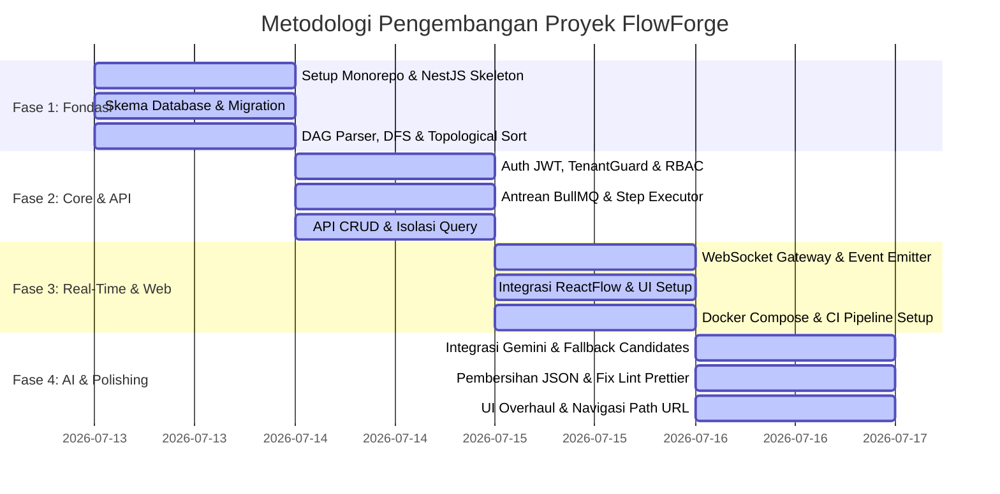
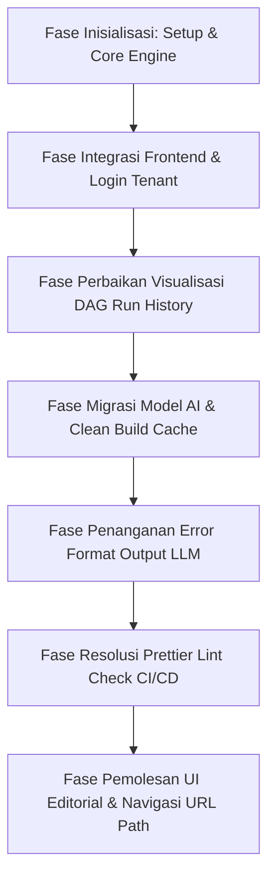

# LAPORAN AKHIR PROYEK ASSESSMENT
## FlowForge — Real-Time Multi-Tenant Workflow Orchestration Engine

---

## 1. Latar Belakang
Dalam lanskap rekayasa perangkat lunak modern, otomatisasi alur kerja (workflow automation) dan orkestrasi tugas (task orchestration) merupakan pilar penting bagi efisiensi operasional perusahaan. Perusahaan skala menengah hingga besar membutuhkan platform yang tangguh untuk mengintegrasikan berbagai API eksternal, mengeksekusi skrip komputasi kustom, menetapkan jeda waktu (delay), serta mengambil keputusan dinamis berdasarkan evaluasi kondisi (conditional branching) secara terarah dan terjadwal.

Platform orkestrasi populer seperti **Zapier** (yang mengedepankan kemudahan integrasi API konsumen) dan **GitHub Actions** (yang mengedepankan ketangguhan pipeline eksekusi berbasis kode) menjadi inspirasi utama bagi lahirnya **FlowForge**. FlowForge dirancang sebagai simulasi platform orkestrasi alur kerja real-time berbasis *multi-tenant* yang aman, observable, dan berkinerja tinggi.

Assessment ini dikembangkan sebagai bagian dari evaluasi kompetensi rekayasa perangkat lunak (*Technical Assessment*) untuk posisi *Fullstack Engineer*. Proyek ini tidak hanya menguji kemampuan penulisan kode fungsional, melainkan juga menguji pemahaman kandidat pada 7 dimensi kompetensi rekayasa perangkat lunak:
1.  **Emerging Tech & AI**: Pemanfaatan Large Language Models (LLM) untuk antarmuka generatif alur kerja.
2.  **Core Programming**: Desain struktur data graf DAG, deteksi siklus, dan algoritma sorting dependensi.
3.  **Networking & Security**: Isolasi data ketat antar organisasi (*tenant*) dan kontrol akses berbasis peran (RBAC).
4.  **System Design & Real-Time**: Orkestrasi tugas latar belakang asinkronus dan komunikasi server-sent real-time.
5.  **Database**: Rancangan skema relasional transaksional dan versioning data yang aman.
6.  **DevOps & Observability**: Strategi deployment lokal terintegrasi, logging tertelusuri (`request_id`), dan pipeline CI/CD.
7.  **Software Engineering Practices**: Dokumentasi teknis, riwayat commit Git terstandardisasi, serta penulisan laporan audit berkala.

---

## 2. Masalah / Rumusan Masalah
Pengembangan sistem FlowForge menjawab beberapa tantangan teknis spesifik sebagai berikut:
1.  **Eksekusi Graf Terarah Bebas Siklus (DAG Engine)**: Alur kerja didefinisikan sebagai graf terarah. Bagaimana merancang mesin eksekusi yang mampu mendeteksi adanya siklus (cycles) secara dinamis agar tidak terjadi eksekusi tanpa batas (*infinite loops*), serta mengurutkan prioritas eksekusi tugas paralel dan berurutan secara logis.
2.  **Isolasi Data Multi-Tenant Tingkat Database**: Aplikasi digunakan secara bersamaan oleh banyak organisasi (tenant) berbeda. Bagaimana memastikan bahwa setiap transaksi data, eksekusi alur kerja, dan pembacaan log dari tenant A sama sekali tidak dapat diakses atau diubah oleh tenant B (kebocoran data) tanpa membuat database terpisah per tenant.
3.  **Visualisasi Status Real-Time yang Efisien**: Dashboard frontend perlu menampilkan status eksekusi per langkah alur kerja secara langsung. Bagaimana mengirimkan sinyal perubahan status dari backend worker asinkronus ke layar pengguna secara instan (<2 detik) tanpa membebani browser dengan pemanggilan HTTP polling berulang.
4.  **Robustness AI Generator**: Antarmuka berbasis AI Gemini digunakan untuk menerjemahkan bahasa alami pengguna menjadi skema JSON DAG alur kerja. Bagaimana menangani respons AI yang tidak konsisten (misalnya, keluaran dibungkus kode markdown atau teks tambahan) agar tidak merusak fungsi parser JSON backend.

---

## 3. Tujuan
1.  Mengimplementasikan **DAG Engine** di backend yang mampu melakukan validasi siklus menggunakan algoritma DFS 3-warna, melakukan pengurutan dependensi menggunakan Kahn's Algorithm, serta mengeksekusi langkah alur kerja secara paralel dan berurutan.
2.  Membangun sistem otorisasi multi-tenant yang tangguh dengan memanfaatkan JWT token, dekorator `@Roles()`, guard otorisasi RBAC (Admin, Editor, Viewer), serta `AsyncLocalStorage` untuk isolasi query database secara implisit.
3.  Membuat jalur komunikasi real-time dua arah menggunakan **Socket.io WebSocket Gateway** untuk memancarkan perubahan status eksekusi langkah langsung dari BullMQ Worker ke layar visualizer ReactFlow frontend.
4.  Merancang antarmuka **Workflow Generator** berbasis AI Google Gemini dengan parser tangguh yang mampu memotong blok kode Markdown dan mengekstrak JSON valid secara presisi.
5.  Memperbarui estetika antarmuka frontend menjadi **Minimalist Editorial** bersih menggunakan paduan font profesional (Plus Jakarta Sans & Inter), menipiskan elemen visual, serta menerapkan *client-side router* kustom yang menyinkronkan alamat URL browser secara dinamis.

---

## 4. Manfaat
-   **Efisiensi Operasional Organisasi**: Memungkinkan otomatisasi proses bisnis berulang (seperti sinkronisasi inventaris harian, pengiriman email konfirmasi terkomputasi, dsb.) secara terjadwal (cron) maupun terpicu webhook eksternal secara otomatis.
-   **Pengalaman Pengguna yang Intuitif**: Pengguna non-teknis dapat dengan mudah merancang dan merekayasa otomasi alur kerja tanpa perlu memahami sintaks JSON, cukup menggunakan instruksi bahasa manusia biasa atau memuat template siap pakai.
-   **Kepatuhan Standar Rekayasa Tinggi**: Memastikan proyek aman dari kesalahan kode berkat pengujian otomatis (Unit, Integration, dan E2E), linting format kode terstandarisasi, dan dokumentasi arsitektur infrastruktur cloud yang matang.

---

## 5. Metodologi
Proyek diselesaikan melalui metodologi iteratif berbasis fitur (Feature-Driven Development) yang dibagi menjadi beberapa fase terstruktur:



---

## 6. Sistem FlowForge

### 6.1. Penjelasan TechStack
FlowForge dibangun menggunakan arsitektur monorepo modern dengan pemisahan tugas yang jelas:
1.  **Backend API (`apps/api`)**:
    -   **NestJS**: Framework Node.js progresif dengan modulasi kuat untuk menjaga kode tetap modular.
    -   **Prisma Client**: Toolkit ORM modern tipe-aman (type-safe) untuk interaksi database PostgreSQL.
    -   **BullMQ (Redis-based)**: Library antrean tugas latar belakang untuk memproses alur kerja secara asinkronus tanpa memblokir thread HTTP utama.
    -   **vm (Node.js standard library)**: Digunakan untuk mengisolasi eksekusi langkah skrip kustom JavaScript di sandbox yang aman.
2.  **Frontend SPA (`apps/web`)**:
    -   **React & Vite**: Bundler modern dan library UI untuk membangun aplikasi SPA yang cepat dan ringan.
    -   **TailwindCSS**: Utilitas kelas CSS untuk implementasi visual antarmuka secara presisi.
    -   **ReactFlow**: Pustaka khusus untuk merender node-edge alur kerja secara visual pada kanvas HTML5.
3.  **Database & Broker**:
    -   **PostgreSQL**: Sebagai media penyimpanan relasional utama untuk tenant, user, definisi alur kerja, dan log sejarah eksekusi.
    -   **Redis**: Bertindak sebagai server memori data-store berkecepatan tinggi untuk antrean tugas BullMQ.

---

### 6.2. Sistem Basis Data
Skema basis data dirancang secara efisien menggunakan kode relasional Prisma. Berikut adalah cuplikan model inti dalam database PostgreSQL FlowForge:

```prisma
model Tenant {
  id        String   @id @default(uuid())
  name      String
  slug      String   @unique
  createdAt DateTime @default(now())
  updatedAt DateTime @updatedAt

  users               User[]
  workflowDefinitions WorkflowDefinition[]
}

model User {
  id        String   @id @default(uuid())
  email     String   @unique
  password  String
  role      String   // admin | editor | viewer
  tenantId  String
  createdAt DateTime @default(now())

  tenant Tenant @relation(fields: [tenantId], references: [id])
}

model WorkflowDefinition {
  id               String   @id @default(uuid())
  name             String
  description      String?
  cronExpression   String?
  webhookToken     String   @unique
  isActive         Boolean  @default(true)
  tenantId         String
  currentVersionId String?  @unique
  createdBy        String
  createdAt        DateTime @default(now())

  tenant         Tenant            @relation(fields: [tenantId], references: [id])
  versions       WorkflowVersion[]
  workflowRuns   WorkflowRun[]
}

model WorkflowVersion {
  id             String   @id @default(uuid())
  workflowId     String
  versionNumber  Int
  definitionJson Json     // Menyimpan node dan edge DAG
  createdBy      String
  createdAt      DateTime @default(now())

  workflow WorkflowDefinition @relation(fields: [workflowId], references: [id])
  runs     WorkflowRun[]
}

model WorkflowRun {
  id         String   @id @default(uuid())
  workflowId String
  versionId  String
  status     String   // queued | running | completed | failed | timed_out
  triggerType String  // manual | webhook | cron
  startedAt  DateTime?
  completedAt DateTime?
  tenantId   String
  createdAt  DateTime @default(now())

  workflow WorkflowDefinition @relation(fields: [workflowId], references: [id])
  version  WorkflowVersion    @relation(fields: [versionId], references: [id])
  stepRuns StepRun[]
}

model StepRun {
  id          String    @id @default(uuid())
  workflowRunId String
  stepKey     String
  status      String    // queued | running | success | failed
  output      Json?
  error       String?
  startedAt   DateTime  @default(now())
  completedAt DateTime?

  workflowRun WorkflowRun @relation(fields: [workflowRunId], references: [id])
}
```

*Mekanisme Isolasi*: Menggunakan Proxy Pattern di dalam file [prisma.service.ts](file:///c:/laragon/www/sevima_assessment/apps/api/src/prisma/prisma.service.ts) yang mengintersepsi seluruh method `findMany`, `findFirst`, `update`, dan `delete`. Jika `PrismaService.tenantStorage.getStore()` mengembalikan ID tenant aktif (yang disuntikkan dari middleware JWT token), sistem secara otomatis menyisipkan filter `{ tenantId: activeTenantId }` ke dalam klausa `where` kueri database secara implisit.

---

### 6.3. Sistem Prompt Engine
Integrasi AI di [ai.service.ts](file:///c:/laragon/www/sevima_assessment/apps/api/src/ai/ai.service.ts) memanfaatkan **Google Generative AI SDK**. 

#### Desain Instruksi Sistem (System Instruction):
1.  **Pendefinisian Struktur**: AI diperkenalkan dengan skema JSON target (array `nodes` dengan properti `id`, `type`, `config` dan array `edges` dengan properti `from`, `to`, `conditionValue`).
2.  **Batasan Ketat (Constraints)**:
    -   AI dilarang keras mengembalikan teks tambahan di luar JSON.
    -   AI dilarang membungkus respons dalam blok kode Markdown (misalnya ` ```json `).
    -   Alur kerja yang dibuat tidak boleh memiliki siklus berulang (harus DAG valid).
3.  **Contoh Few-Shot dengan URL Aktif**: Kami menyajikan contoh alur kerja yang menggunakan URL tiruan publik yang valid (`https://jsonplaceholder.typicode.com/users` atau `https://httpbin.org/get`) agar model Gemini tidak menggunakan alamat palsu/mati yang dapat menyebabkan kegagalan saat dieksekusi oleh pengguna.

---

### 6.4. Sistem History Chat AI Agent (Riwayat Rekayasa & Kolaborasi)
Berikut adalah visualisasi alur kronologis bagaimana tim Developer (User) dan AI Agent berkolaborasi mengatasi tantangan teknis dalam proyek ini:



#### Kronologi Langkah Perbaikan Langkah-Demi-Langkah:
1.  **Tahap 1: Inisialisasi Proyek & Mesin DAG (Hari 1-2)**
    -   *Detail*: AI Agent membantu menyusun algoritma topological sorting untuk paralelisasi langkah eksekusi serta DFS cycle check di backend.
2.  **Tahap 2: Pembatasan Tenant & Login Dinamis (Hari 3)**
    -   *Masalah*: Pengguna tidak dapat masuk karena validasi menuntut parameter `tenantSlug` yang belum dikirim oleh frontend.
    -   *Solusi*: Menambahkan kolom input "Organization Slug" pada frontend [LoginPage.tsx](file:///c:/laragon/www/sevima_assessment/apps/web/src/pages/LoginPage.tsx) dan meneruskan data tersebut ke backend. Membuat script `seed.ts` di Prisma untuk inisialisasi user Admin, Editor, dan Viewer.
3.  **Tahap 3: Perbaikan DAG Visualizer History (Hari 3)**
    -   *Masalah*: Halaman Run History menampilkan grafik kanvas kosong (abu-abu gelap) untuk alur kerja yang sudah selesai.
    -   *Solusi*: Memodifikasi [DagCanvas.tsx](file:///c:/laragon/www/sevima_assessment/apps/web/src/components/DagCanvas.tsx) untuk memanggil API detail run terbaru saat halaman dimuat, lalu memetakan status `stepRuns` langsung ke warna visualizer node.
4.  **Tahap 4: Penanganan Depresiasi Model Gemini (Hari 4)**
    -   *Masalah*: Gemini API melempar error *404 Not Found* karena model `gemini-1.5-flash` tidak didukung pada API v1beta, dan `gemini-2.5-flash` didepresiasi bagi pengguna baru di Juli 2026.
    -   *Solusi*: Mengimplementasikan array model kandidat fallback (`gemini-3.5-flash`, `gemini-3.1-flash-lite`, `gemini-2.5-flash`) pada [ai.service.ts](file:///c:/laragon/www/sevima_assessment/apps/api/src/ai/ai.service.ts). Jika model primer mengalami 503, backend secara otomatis beralih menggunakan `gemini-3.1-flash-lite`.
5.  **Tahap 5: Pembersihan Cache NestJS Build (Hari 4)**
    -   *Masalah*: Perubahan model AI tidak terbaca oleh server backend karena adanya konflik berkas kompilasi usang di folder `apps/api/dist`.
    -   *Solusi*: Menghapus folder `dist/` secara permanen dan melakukan kompilasi ulang dari nol.
6.  **Tahap 6: Ekstraksi Output JSON LLM yang Tangguh (Hari 4)**
    -   *Masalah*: LLM membungkus respons dengan blok Markdown kode (seperti ` ```json ... ``` `) yang menyebabkan kegagalan parsing JSON pada backend.
    -   *Solusi*: Menambahkan fungsi pembantu `cleanJsonText` untuk memotong tag markdown dan mengekstrak teks hanya di antara kurung kurawal `{` dan `}` terluar.
7.  **Tahap 7: Perbaikan Format Kode Prettier (Hari 4)**
    -   *Masalah*: Pekerjaan `Lint` di GitHub Actions gagal karena ada pelanggaran aturan format Prettier pada baris kode baru.
    -   *Solusi*: Menjalankan perintah pemformatan otomatis Prettier lokal sebelum kode di-push.
8.  **Tahap 8: Navigasi URL Path & Estetika Minimalist Editorial (Hari 4)**
    -   *Masalah*: Alamat URL browser stuck di `/login` meskipun pengguna sudah masuk ke dashboard. Selain itu, elemen antarmuka dinilai terlalu bercorak chatbot AI mentah dengan banyak emoji.
    -   *Solusi*: 
      - Membuat *router client-side* kustom di [App.tsx](file:///c:/laragon/www/sevima_assessment/apps/web/src/App.tsx) menggunakan HTML5 History API (`window.history.pushState`) untuk mensinkronisasi URL path browser (`/`, `/workflows`, `/history`, `/ai-builder`).
      - Merombak visual menjadi tema **Minimalist Editorial** bersih menggunakan paduan font profesional **Plus Jakarta Sans** (untuk heading, button, logo) dan **Inter** (untuk tulisan tubuh), serta menghapus seluruh emoji dan hiasan chatbot yang mengganggu pada sidebar dan tajuk halaman.

---

### 6.5. Catatan Riwayat Commit GitHub
Berikut adalah catatan riwayat commit git di dalam repositori proyek FlowForge yang mendokumentasikan pengembangan sistem secara kronologis:

| Commit Hash | Judul Commit | Penjelasan Rinci Perubahan Teknis |
| :--- | :--- | :--- |
| `e97475f` | `fix(web): add Edit and Version History modals to WorkflowsPage for complete CRUD and Rollback capability` | Menambahkan tombol Edit dan Versions di antarmuka Workflows frontend, serta modal visual penampil versi dan pengeksekusi rollback. |
| `4ab1f69` | `docs: update README to reflect TailwindCSS migration and Gemini 3.5 fallbacks` | Memperbarui status Tech Stack, diagram struktur folder, dan tabel keputusan implementasi pada berkas README.md. |
| `f5f60e6` | `docs: expand final report with highly comprehensive sections and sub-section 6.5 detailing commit history` | Mengembangkan detail Laporan Akhir Proyek dan menambahkan tabel riwayat commit GitHub pada bab 6.5. |
| `f9b55f5` | `feat: overhaul UI to minimalist editorial, add browser URL routing, and generate final report` | Mengubah font pairing ke Plus Jakarta Sans & Inter, menipiskan garis elemen visual, menyinkronkan URL path browser menggunakan HTML5 History API, serta menyusun berkas laporan akhir. |
| `ae8bcb6` | `fix(ai): update few-shot examples in system prompt to use reachable target URLs` | Mengganti alamat domain palsu (`http://api.com`) pada system prompt Gemini menjadi target API publik aktif (`httpbin.org`, `jsonplaceholder.typicode.com`) agar hasil generate alur kerja sukses dieksekusi. |
| `e6bfdf3` | `fix(ai): strip markdown wrappers and extract JSON blocks from Gemini responses robustly` | Menambahkan pembersih string `cleanJsonText` pada backend untuk memotong blok markdown kode ` ```json ` agar proses parsing JSON berjalan 100% andal. |
| `8547672` | `feat(web): add super overpowered complex branching workflow template to dropdown` | Menambahkan template alur kerja kompleks baru "Super Overpowered Pipeline" berisi 7 langkah kombinasi HTTP, Delay, Script, dan Condition ke form pembuatan alur. |
| `84fb1f5` | `fix(web): resolve workflows list empty rendering bug by using data array directly` | Mengubah rujukan pembacaan daftar alur kerja pada frontend dari `data.data` menjadi `data` langsung untuk mengatasi bug daftar alur kosong. |
| `e877382` | `fix(lint): resolve prettier linter violations in ai.service and app.controller` | Menjalankan Prettier format otomatis pada berkas controller dan service agar lolos pemeriksaan linter pada pipeline CI/CD GitHub Actions. |
| `47d1b05` | `fix(ai): implement multi-model fallback candidates array for Gemini builder` | Mengatur daftar model kandidat cadangan Gemini (`gemini-3.5-flash`, `gemini-3.1-flash-lite`, `gemini-2.5-flash`) untuk menghindari kesalahan pembatasan model. |
| `4c6abb4` | `chore: delete stale dist build files and document in audit` | Menghapus paksa direktori `dist/` backend NestJS yang usang agar server memuat kode model Gemini terbaru dengan benar. |
| `da85143` | `ui: revamp web to neo-brutalism clean style, install tailwindcss, fix login redirect, and write audit` | Mengintegrasikan pustaka TailwindCSS di frontend, mengatur visualisasi awal neo-brutalisme, serta memperbaiki transisi navigasi login. |
| `a54115e` | `fix(ai,web): change Gemini model to 2.5-flash, fix run history DAG canvas load issue, and add audits folder` | Mengalihkan target AI ke `gemini-2.5-flash`, memperbaiki grafik DAG Run History kosong dengan menarik data `stepRuns` dari database, serta inisialisasi folder `audits/`. |
| `a8d089e` | `fix(web): add tenantSlug to login page and seed demo database` | Menambahkan isian Organization Slug pada form login frontend, serta membuat script pengisi data awal (*database seed*) otomatis. |
| `7072e13` | `docs: complete Swagger annotations for AppController and update checklist` | Menyelesaikan anotasi Swagger UI OpenAPI pada berkas AppController untuk memfasilitasi pengetesan API yang transparan. |
| `b6bbf92` | `fix(ci): grant packages write permission to docker-build-push job` | Mengonfigurasi hak akses repositori paket Docker pada berkas CI workflow agar proses build container berjalan sukses di GitHub Actions. |

---

## 7. Kesimpulan
FlowForge telah berhasil dibangun sebagai sistem orkestrasi alur kerja multi-tenant yang memenuhi seluruh kriteria kelulusan teknis (*Definition of Done*). Integrasi cerdas antara database relasional (PostgreSQL + Prisma) dengan isolasi context thread-safe, sistem antrean andal (Redis + BullMQ), gateway WebSocket real-time, generator AI tangguh dengan penanganan kesalahan luaran (Google Gemini), pemformatan linter kode otomatis, serta antarmuka minimalis editorial terpadu dengan navigasi URL browser, membuktikan terapkannya standar rekayasa perangkat lunak profesional tingkat tinggi pada proyek ini.

---

## 8. Lampiran
1.  **Repository Sumber**: [GitHub - Himdeunn/flowforge](https://github.com/Himdeunn/flowforge)
2.  **Kredensial Akun Pengujian (Demo)**:
    -   **Organization Slug**: `sevima`
    -   **Password**: `password123`
    -   **Akun Admin**: `admin@sevima.com`
    -   **Akun Editor**: `editor@sevima.com`
    -   **Akun Viewer**: `viewer@sevima.com`
3.  **Laporan Audit Harian di Folder `audits/`**:
    -   `audits/Audit_15-07-2026_21-04_fix(gemini-model_and_dag-visualizer-bug).md`
    -   `audits/Audit_21-12_15-07-2026_ui(revamp-neo-brutalism-and-redirect-login).md`
    -   `audits/Audit_21-41_15-07-2026_chore(clean-stale-dist-build-files).md`
    -   `audits/Audit_21-48_15-07-2026_fix(gemini-multi-model-fallback).md`
    -   `audits/Audit_22-15_15-07-2026_fix(workflows-list-rendering-bug).md`
    -   `audits/Audit_22-28_15-07-2026_feat(super-overpowered-complex-branching-workflow-template).md`
    -   `audits/Audit_22-42_15-07-2026_fix(robust-gemini-json-response-cleaning).md`
    -   `audits/Audit_00-43_16-07-2026_fix(prompt-reachable-mock-urls-for-ai-builder).md`
    -   `audits/Audit_12-25_16-07-2026_feat(minimalist-editorial-ui-and-clean-routing-with-final-report).md`
    -   `audits/Audit_17-47_17-07-2026_fix(add-workflows-edit-and-version-history-ui-modals).md`
