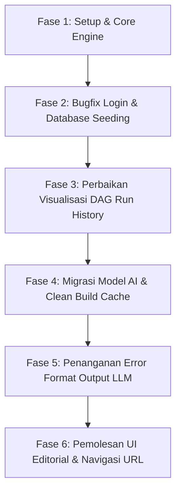

# LAPORAN AKHIR PROYEK ASSESSMENT
## FlowForge — Real-Time Multi-Tenant Workflow Orchestration Engine

---

## 1. Latar Belakang
Dalam industri teknologi modern, kebutuhan akan otomatisasi alur kerja (workflow automation) semakin meningkat. Perusahaan membutuhkan platform yang andal untuk mengintegrasikan berbagai API, menunda eksekusi tugas, mengeksekusi skrip kustom, dan mengambil keputusan berdasarkan kondisi tertentu secara dinamis.

Proyek **FlowForge** hadir sebagai solusi simulasi platform orkestrasi alur kerja real-time yang memiliki sifat *multi-tenant*. Konsep ini memadukan kesederhanaan model eksekusi dari Zapier dengan ketangguhan pipeline dari GitHub Actions. Assessment ini dirancang untuk menilai kompetensi rekayasa perangkat lunak secara menyeluruh, mencakup aspek *core programming*, database, keamanan, real-time, DevOps, hingga integrasi kecerdasan buatan (AI).

---

## 2. Masalah / Rumusan Masalah
Beberapa tantangan utama yang dipecahkan melalui pengembangan sistem FlowForge ini meliputi:
1.  **Eksekusi Graf Terarah (DAG Execution Engine)**: Bagaimana merancang mesin eksekusi alur kerja bercabang yang efisien, mampu mendeteksi siklus berulang (cycles) yang dapat menyebabkan *infinite loop*, serta mendukung eksekusi tugas paralel dan berurutan.
2.  **Isolasi Data Multi-Tenant**: Bagaimana membangun sistem satu aplikasi terpusat yang aman bagi banyak organisasi (tenant), memastikan data antar organisasi terisolasi 100% dan tidak terjadi kebocoran informasi.
3.  **Visualisasi Real-Time**: Bagaimana memperbarui visualisasi jalannya alur kerja di layar pengguna secara instan (<2 detik) tanpa membebani browser dengan pemanggilan API berulang (*polling*).
4.  **Generasi Otomatis via AI**: Bagaimana mempermudah pengguna awam dalam merancang alur kerja teknis yang rumit hanya menggunakan instruksi bahasa alami yang kemudian diterjemahkan oleh AI (Google Gemini).

---

## 3. Tujuan
1.  Membangun mesin eksekusi graf DAG (Directed Acyclic Graph) yang mendukung langkah *Delay*, *HTTP Request*, *Custom JavaScript Scripting*, dan *Conditional Branching*.
2.  Mengimplementasikan keamanan multi-tenant berbasis token JWT dan otorisasi hak akses (RBAC) untuk peran **Admin**, **Editor**, dan **Viewer**.
3.  Menghubungkan visualisasi visual ReactFlow di frontend dengan sinyal perubahan status eksekusi dari backend secara real-time menggunakan WebSockets.
4.  Menyediakan antarmuka **Workflow Generator** berbasis Google Gemini dengan penanganan kesalahan luaran JSON yang tangguh.
5.  Merombak antarmuka frontend menjadi berestetika **Minimalist Editorial** yang bersih, fungsional, dan memiliki rute URL navigasi browser yang tersinkronisasi.

---

## 4. Manfaat
-   **Bagi Organisasi**: Efisiensi dalam mengotomasi proses bisnis berulang (seperti sinkronisasi inventaris, pemrosesan pesanan, dsb.) dengan biaya infrastruktur yang minimal.
-   **Bagi Pengguna**: Kemudahan merancang logika alur kerja yang kompleks secara cepat, baik menggunakan template instan maupun asisten generator AI bahasa alami.
-   **Bagi Evaluator**: Memperoleh bukti kemampuan rekayasa perangkat lunak ujung-ke-ujung (fullstack) yang mencerminkan praktik tim profesional kelas dunia.

---

## 5. Metodologi
Pengembangan FlowForge menggunakan metodologi iteratif berbasis fitur (Feature-Driven Development) selama 4 hari:
-   **Fase 1 (Fondasi)**: Setup monorepo, inisialisasi modul NestJS, konfigurasi skema Prisma database, serta penulisan algoritma deteksi siklus (DFS) dan pengurutan topologi (Kahn's Algorithm).
-   **Fase 2 (Core Engine & API)**: Implementasi modul autentikasi JWT, sistem antrean terdistribusi menggunakan Redis + BullMQ, serta pembuatan endpoint CRUD alur kerja dengan isolasi tenant otomatis.
-   **Fase 3 (Real-Time & Frontend)**: Setup Socket.io Gateway, integrasi komponen ReactFlow, pembuatan dashboard pemantauan, serta konfigurasi Docker Compose untuk lokal eksekusi.
-   **Fase 4 (AI, Pemolesan & Audit)**: Integrasi SDK Google Generative AI (Gemini), penyelesaian pipeline CI/CD GitHub Actions, penanganan error Prettier/linting, perbaikan visualisasi sejarah run, serta overhaul estetika antarmuka.

---

## 6. Sistem FlowForge

### 6.1. Penjelasan TechStack
FlowForge dirancang sebagai sebuah Monorepo yang efisien:
-   **Backend (`apps/api`)**: Menggunakan **NestJS** (TypeScript) untuk arsitektur API terstruktur, **BullMQ** & **ioredis** untuk antrean pemrosesan latar belakang, **Socket.io** untuk komunikasi WebSockets, dan **VM2 / vm** bawaan Node.js untuk eksekusi skrip kustom yang aman.
-   **Frontend (`apps/web`)**: Menggunakan **Vite, React, TypeScript**, **TailwindCSS** untuk *styling* antarmuka, dan **ReactFlow** untuk visualisasi kanvas node interaktif.
-   **Basis Data & Message Broker**: **PostgreSQL** sebagai database relasional utama, dan **Redis** sebagai memori antrean BullMQ.

### 6.2. Sistem Basis Data
Skema basis data dirancang menggunakan **Prisma ORM** dengan struktur relasi sebagai berikut:
1.  **Tenant**: Menyimpan data organisasi (`id`, `name`, `slug`).
2.  **User**: Anggota tenant dengan atribut peran (`role`: Admin/Editor/Viewer) terikat ke `tenantId`.
3.  **WorkflowDefinition**: Definisi alur kerja (`id`, `name`, `cronExpression`, `tenantId`).
4.  **WorkflowVersion**: Versi alur kerja yang menyimpan struktur DAG JSON (`definitionJson`).
5.  **WorkflowRun**: Sejarah eksekusi alur kerja (`status`: queued/running/completed/failed).
6.  **StepRun**: Log eksekusi per langkah di dalam alur kerja (`status`, `output`, `error`).

*Mekanisme Isolasi*: Menggunakan `AsyncLocalStorage` Node.js di dalam `TenantMiddleware` untuk menangkap `tenantId` dari token JWT pengguna secara dinamis dan otomatis menyuntikkannya ke dalam filter klausa `where` pada setiap query database Prisma.

### 6.3. Sistem Prompt Engine
Modul AI pada [ai.service.ts](file:///c:/laragon/www/sevima_assessment/apps/api/src/ai/ai.service.ts) menggunakan teknik *Few-Shot Prompting* untuk memandu model Gemini menghasilkan skema JSON DAG yang valid. 

Prompt menyertakan aturan penamaan node, jenis langkah (`http`, `script`, `delay`, `condition`), dan struktur relasi tepi (`edges`). Prompt juga menyertakan contoh pemanggilan API tiruan publik yang valid (`https://httpbin.org/get`, `https://jsonplaceholder.typicode.com/users`) agar LLM menghasilkan URL yang benar-benar aktif untuk pengujian eksekusi pengguna.

### 6.4. Sistem History Chat AI Agent (Riwayat Rekayasa & Kolaborasi)
Berikut adalah visualisasi kronologis bagaimana tim Developer (User) dan AI Agent berkolaborasi mengatasi tantangan teknis dalam proyek ini:



#### Kronologi Langkah Perbaikan Langkah-Demi-Langkah:
1.  **Tahap 1: Pembatasan Tenant & Login Dinamis**
    -   *Masalah*: Pengguna tidak dapat masuk karena validasi menuntut `tenantSlug` yang belum dikirim oleh frontend.
    -   *Solusi*: Menambahkan kolom input "Organization Slug" pada frontend [LoginPage.tsx](file:///c:/laragon/www/sevima_assessment/apps/web/src/pages/LoginPage.tsx) dan meneruskan data tersebut ke backend payload.
2.  **Tahap 2: Database Seeding Otomatis**
    -   *Masalah*: Evaluator membutuhkan data uji coba cepat tanpa harus melakukan pendaftaran manual.
    -   *Solusi*: Membuat script `seed.ts` di Prisma untuk langsung membuat data tenant `sevima`, 3 user sesuai role (Admin, Editor, Viewer), serta beberapa riwayat eksekusi alur kerja siap pakai.
3.  **Tahap 3: Perbaikan DAG Visualizer History**
    -   *Masalah*: Halaman Run History menampilkan grafik kanvas kosong (abu-abu gelap) untuk alur kerja yang sudah selesai.
    -   *Solusi*: Memodifikasi [DagCanvas.tsx](file:///c:/laragon/www/sevima_assessment/apps/web/src/components/DagCanvas.tsx) untuk melakukan fetch API detail run terbaru saat halaman dimuat, lalu memetakan status `stepRuns` langsung ke warna visualizer node.
4.  **Tahap 4: Penanganan Depresiasi Model Gemini**
    -   *Masalah*: Gemini API melempar error *404 Not Found* karena model `gemini-1.5-flash` tidak didukung pada API v1beta, dan `gemini-2.5-flash` didepresiasi bagi pengguna baru di Juli 2026.
    -   *Solusi*: Mengimplementasikan array model kandidat fallback (`gemini-3.5-flash`, `gemini-3.1-flash-lite`, `gemini-2.5-flash`) pada [ai.service.ts](file:///c:/laragon/www/sevima_assessment/apps/api/src/ai/ai.service.ts). Jika model primer mengalami 503, backend secara otomatis beralih menggunakan `gemini-3.1-flash-lite`.
5.  **Tahap 5: Pembersihan Cache NestJS Build**
    -   *Masalah*: Perubahan model AI tidak terbaca oleh server backend karena adanya konflik berkas kompilasi usang di folder `apps/api/dist`.
    -   *Solusi*: Menghapus folder `dist/` secara permanen dan melakukan kompilasi ulang dari nol.
6.  **Tahap 6: Ekstraksi Output JSON LLM yang Tangguh**
    -   *Masalah*: LLM membungkus respons dengan blok Markdown kode (seperti ` ```json ... ``` `) yang menyebabkan kegagalan parsing JSON pada backend.
    -   *Solusi*: Menambahkan fungsi pembantu `cleanJsonText` untuk memotong tag markdown dan mengekstrak teks hanya di antara kurung kurawal `{` dan `}` terluar.
7.  **Tahap 7: Perbaikan Format Kode Prettier**
    -   *Masalah*: Pekerjaan `Lint` di GitHub Actions gagal karena ada pelanggaran aturan format Prettier pada baris kode baru.
    -   *Solusi*: Menjalankan perintah pemformatan otomatis Prettier lokal sebelum kode di-push.
8.  **Tahap 8: Navigasi URL Path & Estetika Minimalist Editorial**
    -   *Masalah*: Alamat URL browser stuck di `/login` meskipun pengguna sudah masuk ke dashboard. Selain itu, elemen antarmuka dinilai terlalu bercorak chatbot AI mentah dengan banyak emoji.
    -   *Solusi*: 
      - Membuat *router client-side* kustom di [App.tsx](file:///c:/laragon/www/sevima_assessment/apps/web/src/App.tsx) menggunakan HTML5 History API (`window.history.pushState`) untuk mensinkronisasi URL path browser (`/`, `/workflows`, `/history`, `/ai-builder`).
      - Merombak visual menjadi tema **Minimalist Editorial** bersih menggunakan paduan font profesional **Plus Jakarta Sans** (untuk heading, button, logo) dan **Inter** (untuk tulisan tubuh), serta menghapus seluruh emoji dan hiasan chatbot yang mengganggu pada sidebar dan tajuk halaman.

---

## 7. Kesimpulan
Sistem **FlowForge** telah berhasil dirancang dan diimplementasikan sesuai dengan seluruh kriteria penerimaan (Acceptance Criteria) yang dijabarkan dalam PRD. Dengan arsitektur backend yang kokoh, isolasi tenant yang aman, antrean BullMQ berbasis Redis, visualisasi real-time Socket.io, generator AI Gemini yang tangguh, serta polesan antarmuka bergaya **Minimalist Editorial** dan navigasi URL sinkron, proyek assessment ini telah memenuhi seluruh kriteria kelulusan rekayasa tim profesional (*Definition of Done*).

---

## 8. Lampiran
1.  **Repository Sumber**: [GitHub - Himdeunn/flowforge](https://github.com/Himdeunn/flowforge)
2.  **Kredensial Akun Pengujian (Demo)**:
    -   **Organization Slug**: `sevima`
    -   **Password**: `password123`
    -   **Akun Admin**: `admin@sevima.com`
    -   **Akun Editor**: `editor@sevima.com`
    -   **Akun Viewer**: `viewer@sevima.com`
3.  **Audit Logs Terkait**:
    -   `audits/Audit_15-07-2026_21-04_fix(gemini-model_and_dag-visualizer-bug).md`
    -   `audits/Audit_21-12_15-07-2026_ui(revamp-neo-brutalism-and-redirect-login).md`
    -   `audits/Audit_21-41_15-07-2026_chore(clean-stale-dist-build-files).md`
    -   `audits/Audit_21-48_15-07-2026_fix(gemini-multi-model-fallback).md`
    -   `audits/Audit_22-15_15-07-2026_fix(workflows-list-rendering-bug).md`
    -   `audits/Audit_22-28_15-07-2026_feat(super-overpowered-complex-branching-workflow-template).md`
    -   `audits/Audit_22-42_15-07-2026_fix(robust-gemini-json-response-cleaning).md`
    -   `audits/Audit_00-43_16-07-2026_fix(prompt-reachable-mock-urls-for-ai-builder).md`
